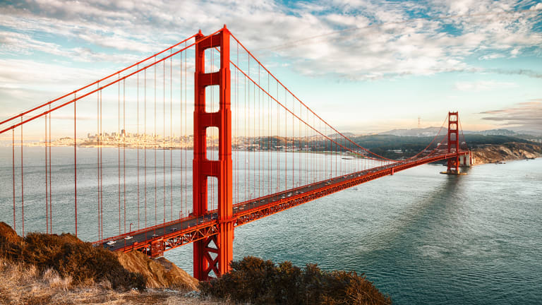
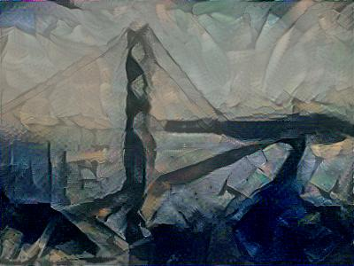
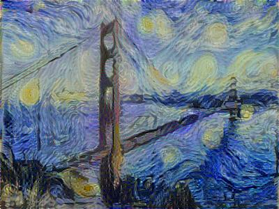
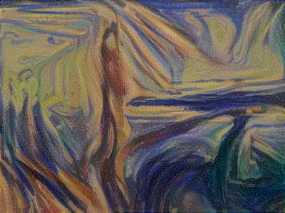
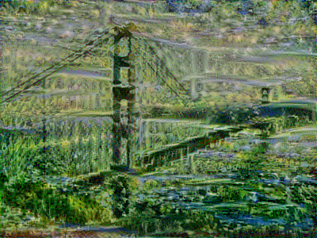
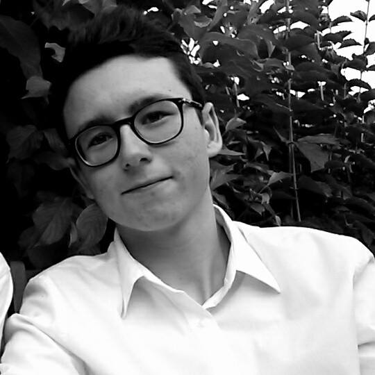
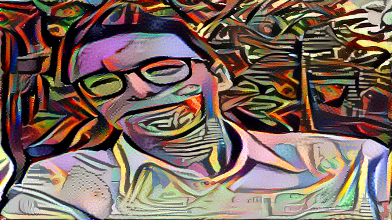
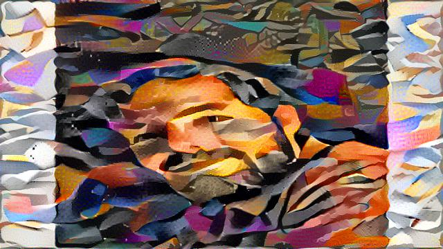

# Neural Style Transfer

TensorFlow implementation of "A Neural Algorithm of Artistic Style" by 
Leon A. Gatys, Alexander S. Ecker, Matthias Bethge (https://arxiv.org/abs/1508.06576).

Based on Course 4 Week 4 practical exercise of deeplearning.ai's Deep Learning Specialization
on Coursera.


Using a pre-trained convolutional neural network, we combine the content of an image and
the style of another to generate a new image.

## Dependencies

Numpy

Scipy

TensorFlow


## Usage

Step1: Install dependencies

Step2: Download pre-trained VGG-19 model (available at http://www.vlfeat.org/matconvnet/pretrained/#imagenet-ilsvrc-classification),
and place it in a "/pretrained-model" directory

Step3:
```
python run.py images/content_image.jpg images/style_image.jpg
```

Step4: Look at the generated images in the "output" directory

## Examples

<div align="center">










</div>